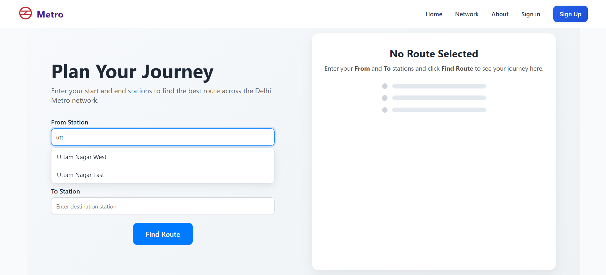
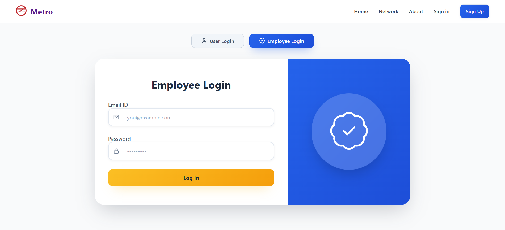
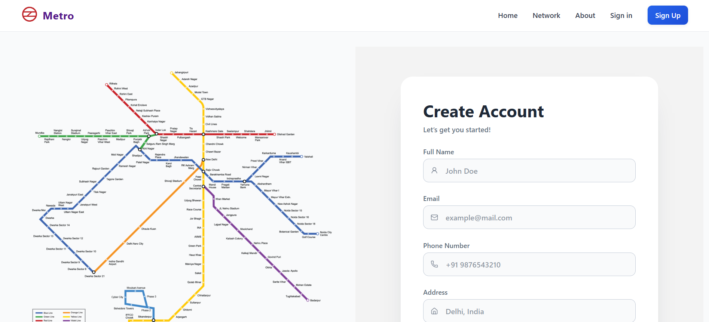
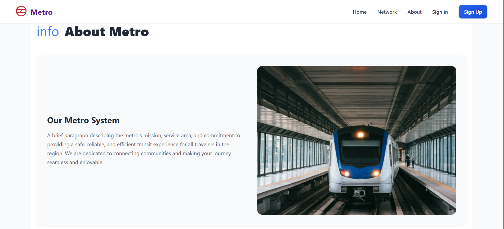
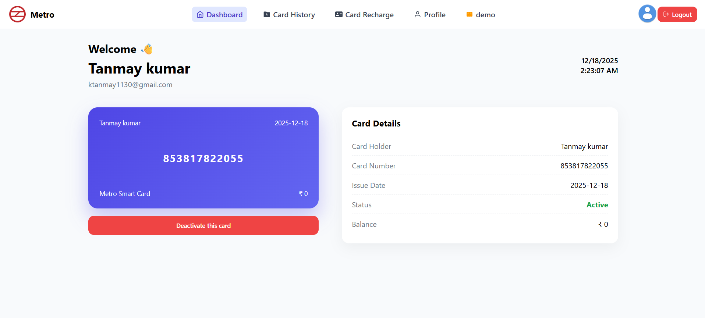
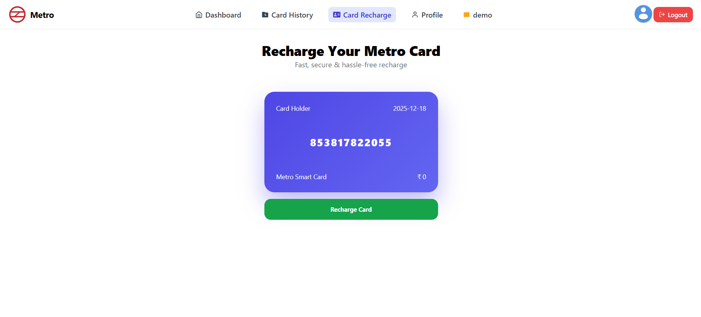
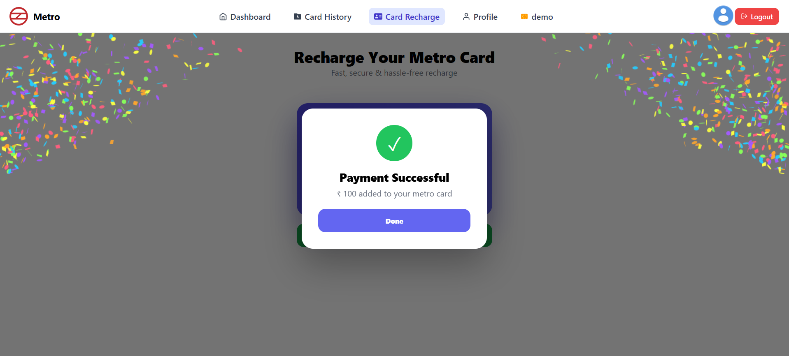
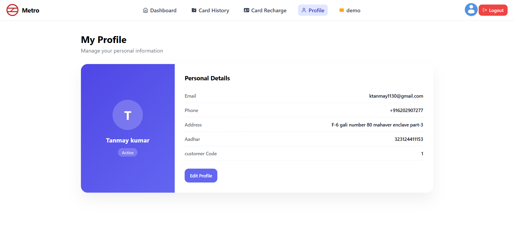
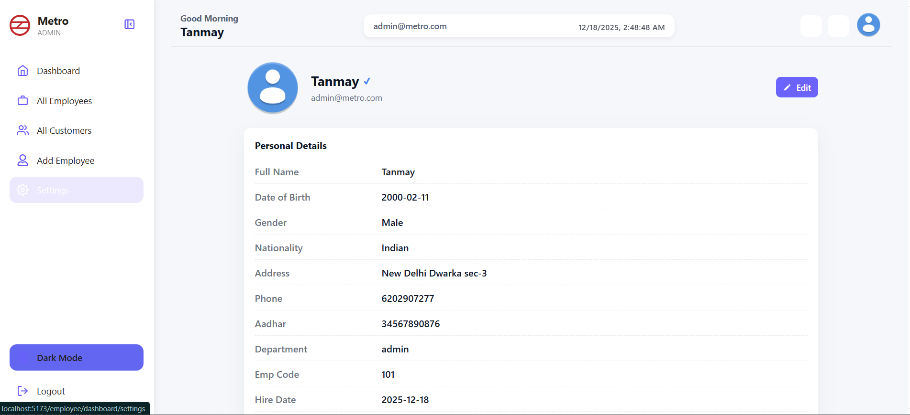
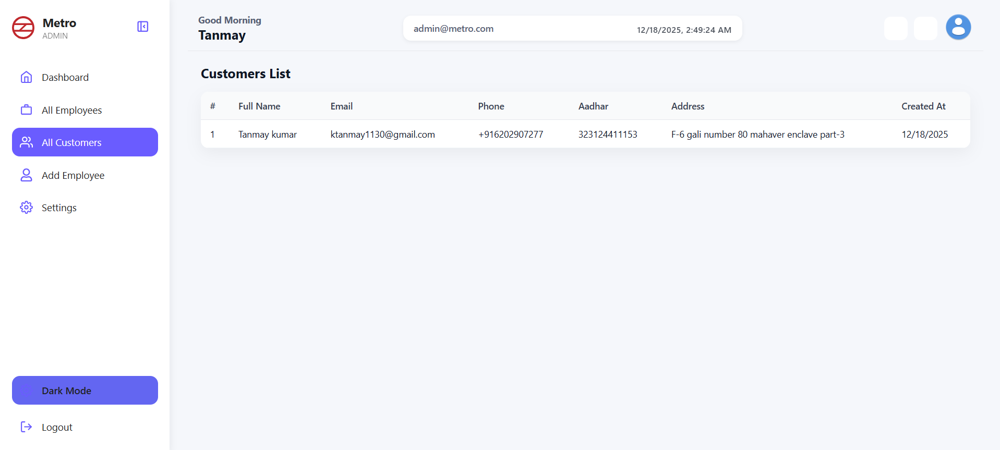

<h1 align="center">Metro Application</h1>

1. **Demo video Link**
    ```bash

2. **Metro back-end**
    ```bash
      https://github.com/itanmay728/metro-back-end

<p align="center">
  A responsive single-page Application of <a>Delhi metro</a>, 
  built to practice and sharpen Java, Spring Boot, Hibernate, MySql, React, React Router Dom.
</p>

---

## 📌 Project Intro

This project is a **Metro Application** where users can:

- Search for metro stations with **live autocomplete**
- See **line colors** (Blue, Yellow, Magenta, etc.) for each station
- Get the **shortest route** between two stations based on **GTFS** data
- View a clean, mobile-friendly **two-panel layout**:
  - **Left**: journey inputs (From / To, swap button)
  - **Right**: route summary and step-by-step station list with interchanges.


> It’s built as a practice project to learn **Java backend + React frontend** integration and to work with real-world data formats.

---

## ✨ Features

- 🔍 **Station Autocomplete**
  - Type at least 2 characters to see matching stations in a dropdown
  - Each suggestion shows the **line color dot**

- 🧭 **Route Finder**
  - Finds the **shortest path (fewest stops)** between two stations
  - Shows total number of stops
  - Displays each station with:
    - Station name
    - Line name
    - Line color indicator

- 🔄 **Swap Stations**
  - One-click button to swap “From” and “To” inputs

- 🔄 **Role Based Login**
  - Admin, Manager, Counter Executive can login buy there email id and password 
  -Admin can add employees like MANAGER, COUNTER EXECUTIVE
  -Admin can see all the data of employee like **attendance** details of employees etc.
  
- 🔄 **users Login**
  -user can register them self and get a metro card
  -They can rechage metro card. 
  -They can see there full history like in-out station name fare deducted current balance.


- 🎨 **Line Colors**
  - Reads `routes.txt` (GTFS) and maps route/line to a **color**
  - Used in search dropdown and route steps

- 📱 **Responsive UI**
  - Two-column layout on desktop (Plan on left, Route on right)
  - Stacked layout on mobile with properly centered content
  - Inputs and buttons are aligned and touch-friendly

- ⚙️ **GTFS-Based Backend**
  - Reads `stops.txt`, `stop_times.txt`, `trips.txt`, `routes.txt`
  - Builds an in-memory graph of stations and edges
  - BFS-based shortest path computation

---

## 🛠 Tech Stack

**Frontend**

- React (Functional Components + Hooks)
- CSS Modules (`Home.module.css`)
- Fetch API for HTTP calls

**Backend**

- Java
- Spring Boot
- OpenCSV (for reading GTFS CSV files)
- In-memory graph data structure (Maps, Lists, BFS)

**Data**

- GTFS files:
  - `stops.txt` – station ID, name, latitude, longitude
  - `routes.txt` – route/line metadata + colors
  - `trips.txt` – trips belonging to routes
  - `stop_times.txt` – sequences of stops per trip

---

## ▶ How to Run the Project

### 1️⃣ Backend (Spring Boot)

#### Prerequisites

- JDK 17+ (or your Spring Boot version’s requirement)
- Maven
- GTFS data for Delhi Metro (with `stops.txt`, `routes.txt`, `trips.txt`, `stop_times.txt`)

#### Steps

1. **Clone / open the backend project**

   ```bash
   cd metrobackend


### 2️⃣ Frontend (React)

1. **Clone the repository:**
   ```bash
   git clone <your-repo-link>


## 📸 Some Screenshots

<table border="1">
  <thead>
    <tr>
      <th style="text-align:center;">Landing page</th>
      <th style="text-align:center;">Route</th>
    </tr>
  </thead>
  <tbody>
    <tr>
      <td></td>
      <td></td>
    </tr>
  </tbody>
</table>

<table border="1">
  <thead>
    <tr>
      <th style="text-align:center;">user Login</th>
      <th style="text-align:center;">Employee Login</th>
    </tr>
  </thead>
  <tbody>
    <tr>
      <td></td>
      <td></td>
    </tr>
  </tbody>
</table>

<table border="1">
  <thead>
    <tr>
      <th style="text-align:center;">user registration</th>
      <th style="text-align:center;">About</th>
    </tr>
  </thead>
  <tbody>
    <tr>
      <td></td>
      <td></td>
    </tr>
  </tbody>
</table>

<table border="1">
  <thead>
    <tr>
      <th style="text-align:center;">user Dashboard</th>
      <th style="text-align:center;">Card Recharge page</th>
    </tr>
  </thead>
  <tbody>
    <tr>
      <td></td>
      <td></td>
    </tr>
  </tbody>
</table>

<table border="1">
  <thead>
    <tr>
      <th style="text-align:center;">After Card recharged</th>
      <th style="text-align:center;">user profile</th>
    </tr>
  </thead>
  <tbody>
    <tr>
      <td></td>
      <td></td>
    </tr>
  </tbody>
</table>

<table border="1">
  <thead>
    <tr>
      <th style="text-align:center;">Admin Dashboard</th>
      <th style="text-align:center;">Admin profile</th>
    </tr>
  </thead>
  <tbody>
    <tr>
      <td></td>
      <td></td>
    </tr>
  </tbody>
</table>

<table border="1">
  <thead>
    <tr>
      <th style="text-align:center;">Add Employee page</th>
      <th style="text-align:center;">All Customer List</th>
    </tr>
  </thead>
  <tbody>
    <tr>
      <td></td>
      <td></td>
    </tr>
  </tbody>
</table>

---

